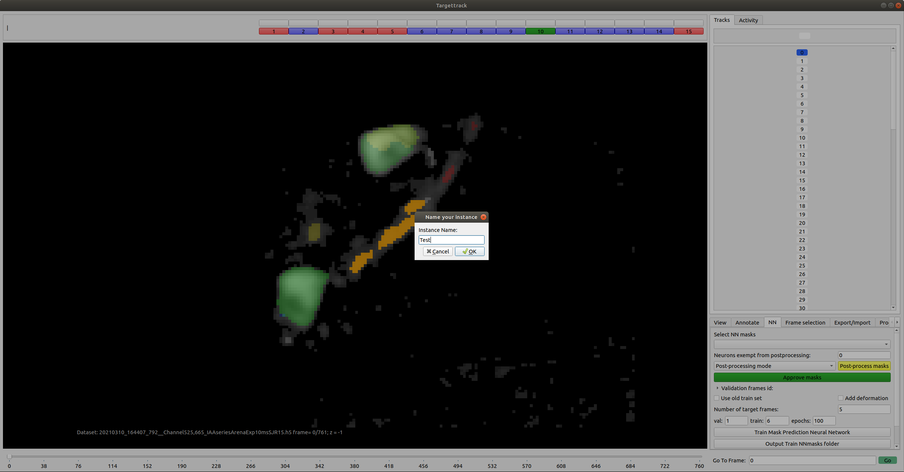
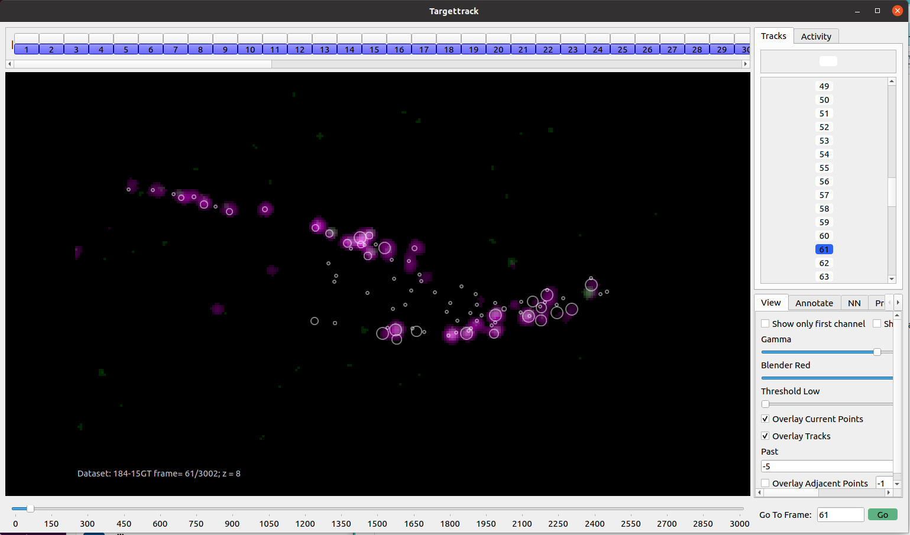
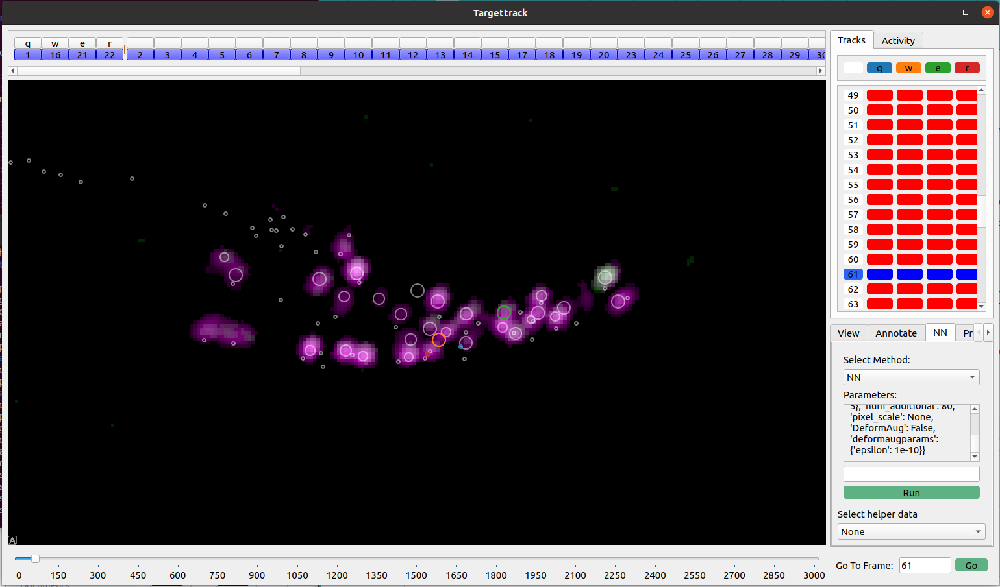
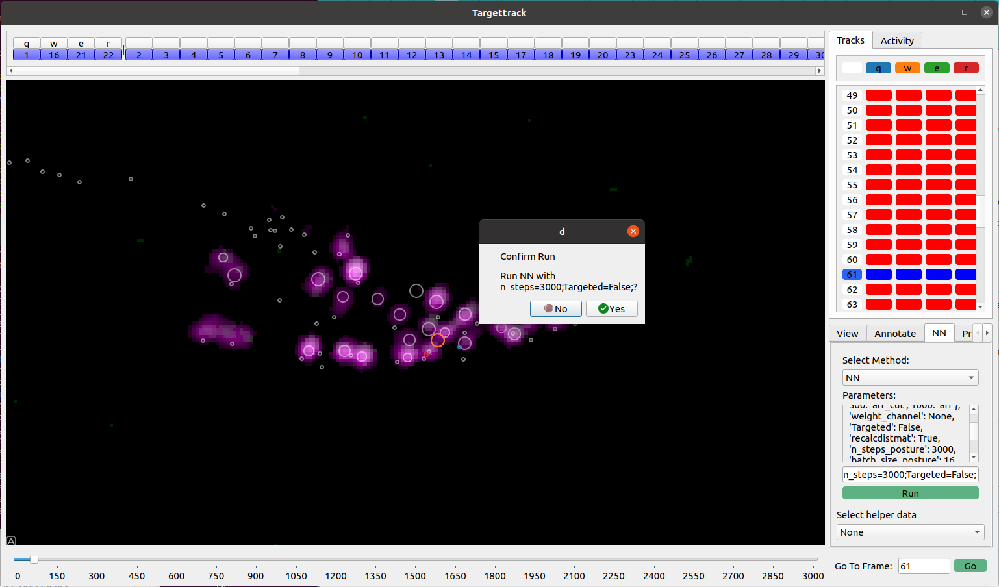
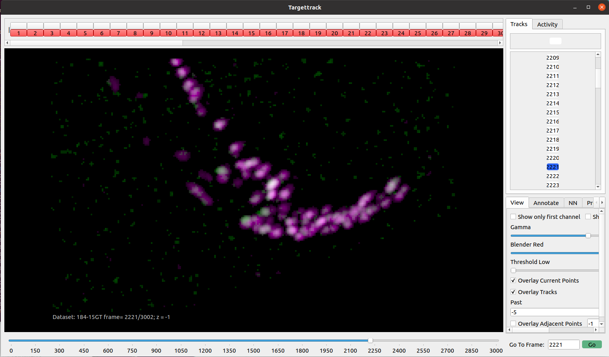
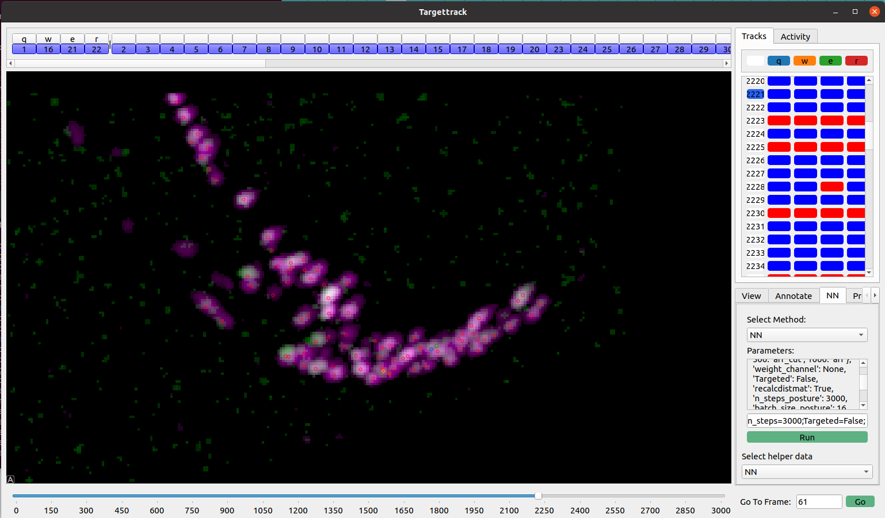

TargetTrack

TargetTrack is a user-friendly graphical interface designed for annotating 3D recordings of C. elegans and tracking neuronal activity. This fork enhances the original functionality by enabling the GUI to run on a local client machine while delegating backend processing to a remote server, optimizing performance and resource utilization.

Features
	•	Local GUI Execution: Run the graphical interface on your local machine for responsive interaction.
	•	Remote Backend Processing: Offload computationally intensive tasks to a remote server, leveraging its processing power.
	•	Secure SSH Tunneling: Establish secure connections between the client and server to ensure data integrity and confidentiality.

Installation

Prerequisites
	•	Local Machine:
	•	Python 3.8 or higher
	•	Conda or Mamba for environment management
	•	SSH access to the remote server
	•	Remote Server:
	•	Python 3.8 or higher
	•	Necessary computational resources for backend processing

Setup Steps
	1.	Clone the Repository:

git clone https://github.com/kirjner/targettrack.git
cd targettrack


	2.	Set Up the Conda Environment on the Local Machine:

mamba env create -f gui_env.yaml
mamba activate targettrack_gui


	3.	Install Required Packages on the Remote Server:
Ensure the remote server has the necessary dependencies installed. You can use the provided server_env.yaml file to set up the environment:

mamba env create -f server_env.yaml
mamba activate targettrack_server


	4.	Configure SSH Access:
Set up SSH keys and ensure that you can connect to the remote server without password prompts. Adjust SSH configurations as needed to facilitate seamless connections.

Usage
	1.	Start the Remote Server:
On the remote server, navigate to the targettrack directory and run:

python hpc_gpu_server.py


	2.	Establish an SSH Tunnel from the Local Machine:
Set up port forwarding to securely connect to the remote server:

ssh -v -N -L 18861:remote_server_address:18861 your_username@remote_server_address

Replace remote_server_address with the actual address of your remote server and your_username with your username on that server.

	3.	Launch the GUI on the Local Machine:
With the SSH tunnel active, run the GUI launcher:

python gui_launcher.py /path/to/your/datafile.h5

Replace /path/to/your/datafile.h5 with the path to your HDF5 data file.

Contributing

Contributions are welcome! Please fork the repository and submit a pull request with your enhancements or bug fixes.

License

This project is licensed under the MIT License. See the LICENSE file for details.

Acknowledgements

This project builds upon the original TargetTrack developed by the Rahi Lab.

For detailed information on system requirements and dependencies, please refer to the original TargetTrack README below

---

# Targettrack
This is the user manual for the graphical interface(GUI) for segmenting and editing *C. elegans* volumetric images. The GUI and the method is designed for 3D tracking.

# From the authors
We understand it could be exhaustive to install and run external code. If you encounter any problems, please do not hesitate to corefranciscopark@g.harvard.edu or mahsa.barzegarkeshteli@epfl.ch for assistance, we will be happy to help even if it is a very simple problem :)

# Requirements
## System Requirements
- Processor (CPU): Intel Core i5 or AMD Ryzen 5 or higher
- Operating System: Aesthetically best on Linux(Tested on Ubuntu, Mint), but all functionalities available on Mac and Windows. However, since a Mac cannot have a CUDA compatible Nvidia GPU, the GUI can only be used for annotation and proofreading.
- Memory (RAM): 16GB+ (32GB+ recommended)
- Storage : SSD highly recommended for fast IO, please have at least 4x (size of your h5 data) available for smooth running
- :red_circle: GPU: (optional but highly recommended if training a network) NVIDIA 2080 Ti or higher recommended, a large-memory GPU is preferred over a fast boost clock GPU. Especially, gaming GPUs are enough for this purpose.

## Dependencies
- python=3.8.13  #3.9 and 3.10 works but hasn't been tested throughly
- pytorch=1.11.0 # 1.8 ~ 1.10 all seems to work, but is not guaranteed
- matplotlib>=3.5.2
- numpy>=1.23.4
- pandas=1.1.3
- scikit-image>=0.18.1
- scikit-learn>=0.23.0
- umap-learn=0.5.3
- scipy>=1.9.1
- tqdm>=4.59.0
- sparse=0.13.0
- nd2reader=3.2.3
- PyQt5=5.12
- pyqtgraph>=0.11.0
- opencv-python>=4.5.1.48
- opencv-python-headless>=4.5.1.48
- h5py>=3.6.0
- albumentations>=0.5.2
- connected-components-3d>=3.2.0
- torchvision>=0.12.0
- alphashape>=1.3.1
- jupyter=1.0.0 # Only if you want to customizer your deformations

If these packages are installed, the GUI and neural network is supposed to run without further installation process. However, if you encounter a bug, please follow the steps below.

# Installation Steps (Estimated Time: <20 mins)

1. Clone this repository: ```git clone https://github.com/lpbsscientist/targettrack```
2. If you don't have conda or miniconda installed, download it from https://docs.conda.io/en/latest/miniconda.html.
3. In your command line, run each of the commands in install.txt (except the first, if you have already cloned the repository).
This will create a virtual environment and install the necessary packages.
4. Place your `.h5` data file in the "targettrack" folder then run the program from your command line with `python3 gui_launcher.py [dataset name]`,
where `[dataset name]` is the name of your file.

## Common installation errors
- We recommend using `pip install opencv-python` instead of conda to install opencv
- We recommend sticking to pytorch 1.11.0 installed from https://pytorch.org/get-started/locally/

# Preparing your data into our `.h5` format

## Exporting to hdf5 files from a different system or language

- The file must end with the suffix .h5
- All images should have the same (Channel,Width,Height,Depth) dimensions and should be saved as hdf5 datasets with name `0/frame` ~ `N-1/frame` for N images
- The dimension information should be saved as hdf5 attributes as `C`=Channel, `W`=Width, `H`=Height, `D`=Depth
- The hdf5 attribute `N_neurons` should be set to a integer >1 and the number of images should be saved as `T`=N

## For python users
Please refer to the script src/assembleh5.py. (The estimated reading time is 3 minutes.) It is a very short script  generating a hdf5 file at `data/example.h5`

# Running demo for mask annotations
We guide you step-by-step through the demo:
1. Download the sample `.h5` file from https://drive.google.com/drive/folders/1-El9nexOvwNGAJw6uFFENGY1DqQ7tvxH?usp=sharing . This file is a denoised, aligned, and cropped movie of a freely moving worm in red channel. It has around 150 annotated frames and results of training the neural network on 5 of those frames.
2. Open the sample file using `python3 gui_launcher.py epfl10_CZANet_Final.h5`
  <p align="center"> 
   
  </p>
  
3. Check the `Overlay mask` checkbox to see the annotated frames' masks. Notice that the present neurons in each frame are marked with blue in the neuron bar on top and absent ones by red. 
  <p align="center"> 
   
  </p>
  
4. Highlight the masks by pressing on their corresponding key in the neuron bar. The highlighted neurons' key becomes green as you can see in the figure below (orange when the highlighted neuron is absent). 
You can change the label of the highlighted neurons by pressing the `Renumber` button in the `Annotate` tab.
<p align="center"> 
 
</p> 

5. In order to train the neural network, open the `NN` tab. Set the number of training set, validation set, and epochs in the corresponding boxes and press the `Train Mask Prediction Neural Network` button. 
Once you enter the name of the run, the program will copy the file in the `data/data_temp` folder and train the neural network on the new file. The neural network needs to be trained on a GPU with at least 6GB capacity. It takes around 10 minutes to train the neural network for 100 epochs with 6 training frames and 1 validation frame on Ubuntu 18.04.6 with GeForce RTX 2080 Ti graphics. 

<p align="center"> 
 
</p> 

**Note**: if you had an unsuccessful or unfinished run, delete the temporary files in the `data_temp` directory before starting the next run.

6. To check the performance of the neural network, open the file in `data/data_temp`. Choose the run name under `Select NN masks`. You can see the predictions for all frames if you check the `Overlay mask` checkbox. Below you can see the NN predictions for frame 115 (left) by the run `CZANet_Final`, which was trained on 5 frames (right).
<p align="center"> 
 
 
</p>

More instructions and useful commands can be found in `Tutorial_Mask.md`.

# Running demo for point annotations

## Basic commands:
- "v","b","n","m",",","." respectively to move [-100,-10,-1,1,10,100] frames
- Hit assigned keys (explained below) to place an annotation at the current mouse location
- "d" to remove the point closest to the mouse
- "c" to rotate the image (this operation changes the data)
- "a" to enable/disable auto--centering (automatically finds the local maximum)

We guide you step-by-step through the demo:
1. Download the sample `184_15GT.h5` file from https://drive.google.com/drive/folders/1rsvVpegiDpHz3hpRChVn63XW8lm0K6xx?usp=share_link, and move it to the ```data``` folder. This file is a difference of Gaussian(DoG) filtered, rotated and centered movie of a freely moving worm in red/green. No non rigid image transformation was applied to the images.

2. Open the sample file using ```python3 gui_launcher.py data/184_15GT.h5```. Time ``266,  358,  653,  855, 1172, 1466, 1479, 1492, 1773, 2064, 2095,
       2465, 2601, 2738, 2913`` has points in this dataset.
  <p align="center"> 
   
  </p>
  
3. You can assign a key to a neurons by pressing the blank button on top of the top bar. Press down the corresponding key to annotate a neuron. You can highlight the points by pressing on their corresponding key in the neuron bar or by clicking on it. The highlighted neurons' key becomes green as you can see in the figure below (orange when the highlighted neuron is absent). The Tracks tab also displays the presence of neurons.
<p align="center"> 
 
</p> 

4. In order to train the neural network, open the `NNTA` tab. Select 'NNTA' as the method. Set the number of minimal annotations to be a GT frame, deformation parameters, etc with the format "key=value;key=value;". The `value` will be processed by `eval(value)` in python. Now press the `Run` button. The program then trains a neural network with a progress bar indicating which step it is on. Other pipelines can be integrated here.
<p align="center"> 
 
</p> 

5. To check the performance of the neural network, choose 'NNTA' under `Select helper data`. Below you can see the NN predictions (left) which was trained on 15 frames (right).
<p align="center"> 
 
 
</p>

# FAQ
:warning: to be added
