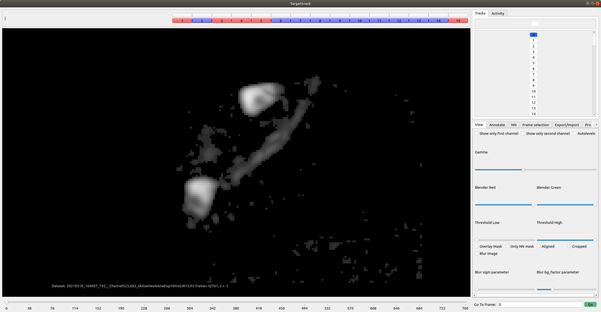
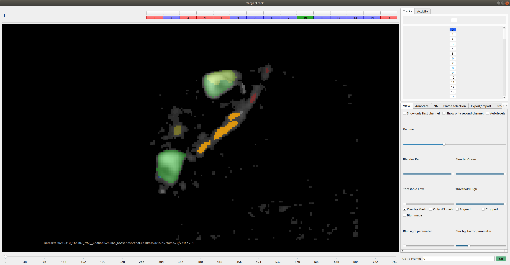
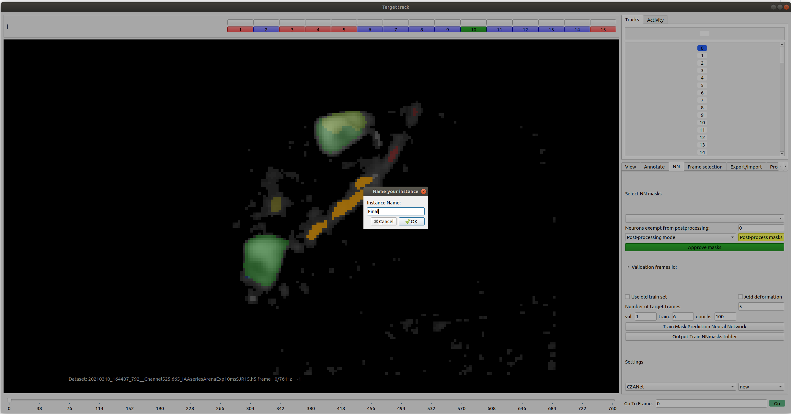
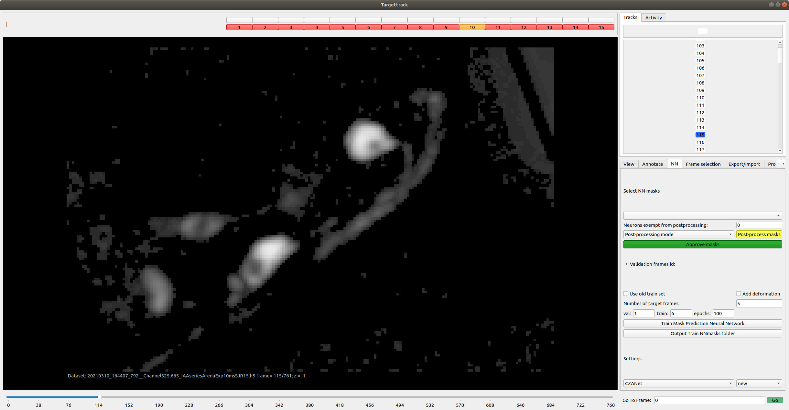
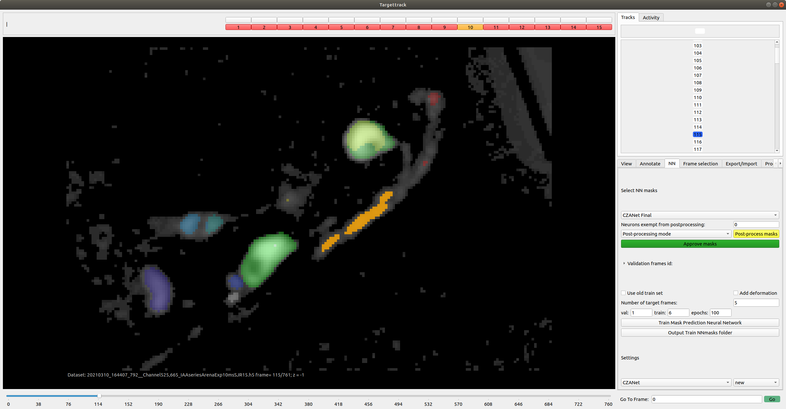
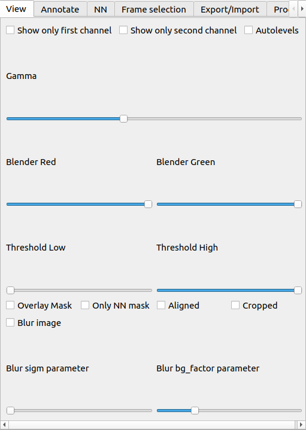
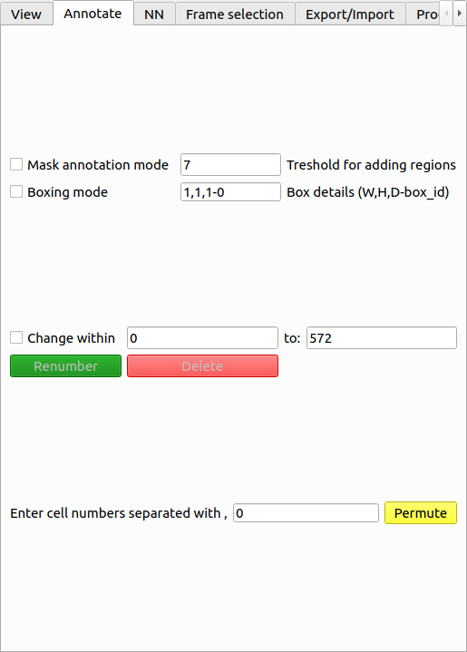
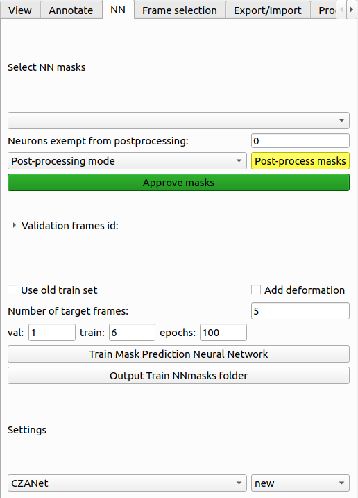

# Targettrack
This is the user manual for the graphical interface for segmenting and editing *C. elegans* 3D images.

# Requirements
- python 3.8
- ipython, matplotlib, numpy, pandas, scikit-image, scikit-learn, scipy, tqdm, sparse, nd2reader, PyQt5, pyqtgraph, opencv-python, opencv-python-headless, h5py, albumentations, connected-components-3d, torchvision, alphashape

# Installation Steps

1. Clone this repository ("git clone https://github.com/lpbsscientist/targettrack").
2. If you don't have conda or miniconda installed, download it from https://docs.conda.io/en/latest/miniconda.html.
3. In your command line, run each of the commands in install.txt (except the first, if you have already cloned the repository).
This will create a virtual environment and install the necessary packages.
4. Place your `.h5` data file in the "targettrack" folder then run the program from your command line with `python3 gui_launcher.py [dataset name]`,
where `[dataset name]` is the name of your file.

# Running demo
We guide you step-by-step through the demo:
1. Open the sample file using `python3 gui_launcher.py epfl10_CZANet_Final.h5`
  
 
   
  

2. Check the `Overlay mask` checkbox to see the annotated frames' masks. Notice that the present neurons in each frame are marked with blue in the neuron bar on top and absent ones by red. 
  
 
   
  

3. Highlight the masks by pressing on their corresponding key in the neuron bar. The highlighted neurons' key becomes green as you can see in the figure below (orange when the highlighted neuron is absent). 
You can change the label of the highlighted neurons by pressing the `Renumber` button in the `Annotate` tab.

 
 

 
4. In order to train the neural network, open the `NN` tab. Set the number of training set, validation set, and epochs in the corresponding boxes and press the `Train Mask Prediction Neural Network` button. 
Once you enter the name of the run, the program will copy the file in the `data/data_temp` folder and train the neural network on the new file.

 
 

 
5. To check the performance of the neural network, open the file in `data/data_temp`. Choose the run name under `Select NN masks`. You can see the predictions for all frames if you check the `Overlay mask` checkbox. Below you can see the NN predictions for frame 115 (left) by the run `CZANet_Final`, which was trained on 5 frames (right).

 
 
 

# User Guide
### Preparing the h5 file
This program is designed for 3D movies in `.h5` file format. The `.h5` file should have T groups where T is the number of volumes (times) in the movie. 
The volume at time t (where t ranges from 0 to T-1) is saved as the member 'frame' of group t. 
The `.h5` file should also contain the following attributes:\
"name"= name of the movie\
"C" = number of channels in the movie\
"W" = width of each volume\
"H" = height of each volume\
"D" = depth of each volume\
"T" = number of volumes in the movie\
"N_neurons" = number of neurons which is set to zero before annotation.
You can use the script `nd22h5.py` to convert the `.nd2` files obtained by Nikon Eclipse Ti2 spinning disc confocal microscope into proper `.h5` file format for the Targettrack GUI.
The program will save segmentation masks for each frame t as the member "mask" of the group t in the '.h5' file.

For example, if `ds` is the `h5` file opened in python, `ds["3/frame"]` contains the 3D video image of time 3 (which is the fourth time of the video).

### The interface
After opening the '.h5' file, you will see the first volume of the movie as the main part of the window. Then, using the wheel of the mouse, you can go through different Z-stacks of your volume.
If the movie already contains masks for some frames, there will be a bar of neuron numbers on the top of the window. The neurons present in each frame are colored blue, and the absent ones are colored red.\
On the bottom of the window, you see a slider for going through different volumes. You can also use the keys `m` and `n` on your keyboard to go to the next or previous volume respectively.\
There are multiple tabs on the bottom right side of the window for viewing, editing, or exporting the movie. 

### The neuron bar
If you are in the `overlay mask` mode, you can highlight each neuron by clicking on its corresponding number. The key of the highlighted neuron becomes green in the frames when the neuron is present and yellow when it is absent. You can also assign one of the keys `q`,`w`,`e`,`r`,`t`,`y`,`u`,`i`, and`o` to any of the annotated neurons by clicking on the white button on top of the neuron number. After assigning the key, it will show up in the `track` tab on top right side of the window. There, you can see list of volumes where the neuron is present (marked by color blue).

### View tab
This tab is used for improving the visualization of the movie. You can view different aspects of the volume using the following checkboxes:\
`Show only first channel`: this option only displays the first channel in multichannel movies.\
`Show only second channel`: this option only displays the second channel in multichannel movies.\
`Autolevels`: auto levels the image for display.\
`Overlay mask`: shows the mask for the annotated frames.\
`Only NN mask`: displays the neural network's predictions (if available) even for the ground truth images.\
`Aligned`: if rotation matrices have already been computed in the `Processing` tab, this option shows the aligned volume. We used the method introduced in  https://github.com/bing-jian/gmmreg-python for the alignment of 3D volume images to have the worm's neurons aligned as much as possible across frames.\
`Cropped`: if the alignment has already been done and the cropping region is determined through `Processing` tab, this option displays the cropped image.\
`Blur image`: it applies blurring using the difference of Gaussians method on the first channel of the image by default. If you choose `Show only second channel` checkbox, the second channel will be blurred. The parameters used for applying blurring are set from the slide bars below the checkbox.

 
 

### Annotation tab
This tab is used for annotating the volumes. It can be used for correcting the predictions of the neural network or the 
results of the watershed segmentation method (implemented in `Processing` tab). There are two modes of annotating a region from scratch:
- `Mask annotation mode`: it uses the value in the `Threshold for adding regions` box as the threshold. 
If you right-click on any pixel, a box will ask you to enter the number of the neuron you want to annotate. After entering the number N, all the pixels around the clicked pixel with higher values than the threshold will be labeled with N. You can change the threshold either by entering a new threshold value in the threshold box or by middle-clicking on a pixel. If you middle-click on a certain pixel, the value of that pixel will be used as the new threshold.\
- `Boxing Mode`: it adds new regions to the mask by defining a box with desirable dimensions. You can set the length, width, 
height, and the label of the box you want to add in the `Box details` box. After setting the dimensions and the label, you 
can left-click on the pixel where the bottom left corner of the box should be. If you choose 0 as the label of the box, it will work as an eraser for your masks.

The actions of `Boxing Mode` and `Mask annotation mode` can be reversed by pressing the key `z`.

In addition to annotating from scratch, you can also change the labels of existing masks or delete them using the following buttons:\
`Renumber`: You first click on the number of the neuron you want to relabel on the neuron bar and highlight it. This will activate the `Renumber` button. Upon pressing the `Renumber` button, you get asked to enter the new label you want to use for the neuron. After entering the new label, if the neuron you chose has only one connected component, it will be relabeled immediately. If it has multiple disjoint components, you are asked to relabel all those components or only one of them. If you choose `cancel`, all the components will be renumbered. If you choose `Ok`, you have to right-click on a pixel inside the region you want to renumber to only relabel that component and not the others.\
If you want to renumber a neuron in more than one frame, you can check the `Change within` checkbox and set the interval of the frames you want use for renumbering.

`Delete`:You first click on the number of the neuron you want to relabel on the neuron bar and highlight it. This will activate the `Delete` button. Upon pressing the `Delete` button, the desired neuron will be deleted.
The actions of Deleting and renumbering can be reversed by pressing the key `z` if they are only applied on one frame.

`Permute`: You permute labels of more than one neuron at once. If you enter the list of neurons separated by "," then the label of each neuron wil change to the label of the one after it. For example if you enter `1,2,3` in the permute box, the label of neuron 1 changes to 2, 2 changes to 3 and 3 changes to 1.

 
 

### NN tab
This tab is designed to train the neural network (NN) directly from the GUI. The GUI will copy of the `.h5` file in the `data/data_temp` folder and save the result of the NN in that file.
#### Training neural network
To train the neural network, enter the number of validation set, training set, and the epochs for training in the corresponding 
boxes and press the `Train Mask Prediction Neural Network` button. Note that the sum of validation and training set should not exceed the total number of annotated frames.
#### Generating target frames
This can be done only after one successful run of the neural network. To generate the deformed frames, check the `Add deformation` checkbox and enter the number of deformed frames you want to generate in the `Number of target frames` box.
#### Checking NN results
The results of the NN are saved in the copied file in `data/data_temp` folder. If you open the file, check the `Overlay mask` checkbox in `View` tab, and choose the NN instance in the `Select NN masks` choice box, you can see the predictions of the neural network on all the unannotated frames. To see the prediction on the annotated ground truth frames, you can use the `Only NN mask` checkbox in `View` tab. If you want to focus on the validation set, you can open the `Validation frames id` collapsible box to see which frames were assigned to the validation set in that run.

#### Post-processing NN results
There are multiple modes of post-processing you can use to improve NN predictions. You can enter the mode in the `Post-processing mode` choice box, and one of the following post-processings are applied on all the selected frames.

-Mode 1: it goes through all the cells, and whenever the masks of two cells are touching each other, it relabels the smaller neuron to the label of the larger one. Only the neurons listed in the `neuron list` box are exempted from this modification.

-Mode 2: this post-processing mode is basically like the previous one but uses different connectivity criteria to decide whether the neurons are touching each other or not. If the neurons are only neighbors across Z direction, it doesn't relabel them. Only the neurons listed in the `neuron list` box are exempted from this modification. 

-Mode 3: if any of the neurons listed in the `neuron list` box touch each other and form one connected component, it renames all the smaller neurons in that region to the largest one. 

-Mode 4: if any of the neurons in `neuron list` has multiple disjoint components, it deletes all the components that have smaller volumes.

-Mode 5: If any of the neurons listed in the `neuron list` box touch each other and form one connected component, it renames all the segments in the connected component to the first neuron in the list.

Finally, if the results look good enough after postprocessing, you can save it as ground truth mask using the `Approve mask` button.

 
 

### Frame selection
This tab is designed mainly to choose a subset of frames for editing or annotating. You can either use a percentage of segmented, non-segmented, or all frames here or manually enter the exact id of the frames you want to choose. 
To choose a percentage of frames, write the percentage you want in the percentage box, fill one of the options `segmented frames`, `non segmented frames`, or `all` frames based on your need, and push the `Select` button.

To choose a specific set of frames, enter the number id of those frames separated with a "," in the box at the bottom of the tab, fill the `manual selection` choice, and push the `Select` button.

You can also use the reference frame for alignment in this tab. If you push `Use this frame as reference` button, the current frame will be used as a reference to align all other frames with respect to it in the Processing tab.

### Export/Import tab

This tab is designed for modifying the movie file. The tab can be used to transfer masks from one movie to another. To import mask from another `.h5` file (source file) to the current file (target file), the address of the source file should be entered in the `Address of the imported masks` box. If the source file is rotated w.r.t. the current file (rotation function derived in the Processing tab), you should check the `reverse transform` checkbox to reverse the rotation. By pressing `import` button, the masks from the source file will replace any existing masks in the target file. If instead, you press `import as green mask`, only regions that are not already labeled will be labeled based on the source files masks.\
In addition to importing masks, you can also export edited version of the current movie as a new `.h5` file using this tab. The exported movie will only contain the frames selected in the `Frame selection`. There are multiple options for editing the movie before exporting it.\
`Rotate and crop`: this option applies the rotation and translation derived in `Processing tab` on the frames and then crops the frames based on the region you selected in `Processing tab`. The resulting frames, which will have a smaller size than the current frames, will be saved as an external file.\
`auto delete`: This option is useful for recordings of the freely moving worm where the worm gets out of the field of view (FOV) in some time points. This option detects the frames where the worm is substantially outside of the FOV by using coarse segmentation from `Processing tab`. If the coarse segmentation results in less than 3 objects in one frame, autodelete mode will exclude that frame while exporting.\
`save red channel` and `save green channel`: if the movie has more than 1 channel, this option saves only the first or the second channel respectively.\
`Blur`: it blurs the frames using the difference of Gaussians method with parameters set in the `background factor` and `sigma` box.\
`Subtract bg`: it will set all the pixels with a value less than a threshold to zero. This can be used to reduce the background noise. The threshold is set in the background box.\
`Resize image`: Resizes the movie in X and Y direction using nearest neighbor or bicubic interpolation for masks and images respectively (https://docs.opencv.org/4.x/da/d6e/tutorial_py_geometric_transformations.html).
`Choose frames from`: if you want to export only a subset of the frames, you can enter the desired interval in the boxes of this section.\
`Delete frames and intervals`: if you want to exclude certain frames or intervals in the exported movie, you can enter them in this section.\
`Choose x/y/z from ... to`: if you want to crop the movie in any of the X, Y, or Z directions, you can enter the cropped regions coordinates in this section. The cropping performed in this tab is different from the one performed in `Processing` tab, which applies cropping only on the rotated and aligned frames. If the X coordinate you start from has a negative value, you will have zero paddings at the left side of your frames. Similarly, if the X coordinates you end at are larger than the frames' width, you will have zero paddings on the right side. The same goes for Y and Z directions.

### Processing tab

This tab is used mainly for segmenting the frames and aligning them.
#### Segmentation
1. First, select the frames you want to segment using `Frame selection` tab. 
2. After that, you can tune the segmentation parameters using the `segmentation parameter` collapsible box.
3. Push the `Test segmentation on current frame` button to check the result of each parameter set.
4. If the results look good, press the `segmentation` button to segment all the selected frames.

#### Alignment
1. Check the coarse segmentation checkbox
2. Set the `perc` parameter high enough such that only a few objects are segmented in each frame (To check if the threshold set by `perc` i good enough, use the `Test segmentation on current frame`)
3. If the threshold is good enough, press the `segmentation` button to coarse-segment all the frames.
4. Find a frame that you want to use as the reference to align all other frames. Go to that frame and push the `Use this frame as reference` button in the `Frame selection` tab to save that frame as the reference.
5. Push the `Compute rotation` button to compute the rotation and translation for each frame to align it to the reference frame. When the computation is finished, you can check the results using the `Aligned` checkbox in the `View` tab.
6. After the alignment, you can crop the movie. First, push the `Crop` button. Then left-click on the four corners of the rectangle you want to crop and press the `Crop` button again. The crop region will be computed automatically to include the corners you clicked and be a multiple of 32. To check the results, you can use the `Cropped` checkbox in the `View` tab.

